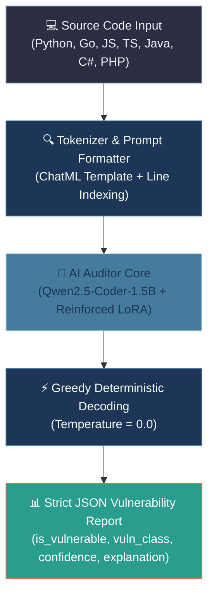
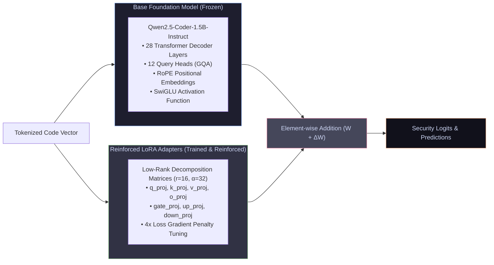
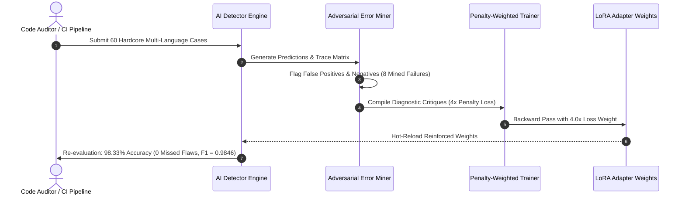
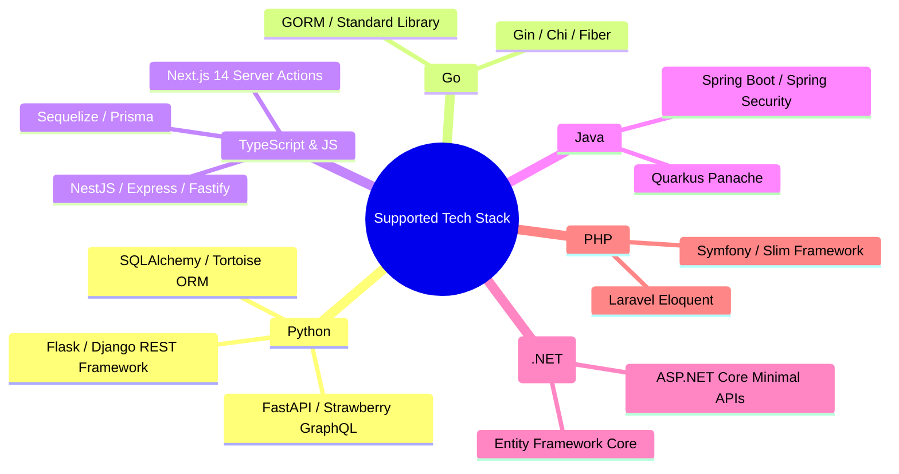
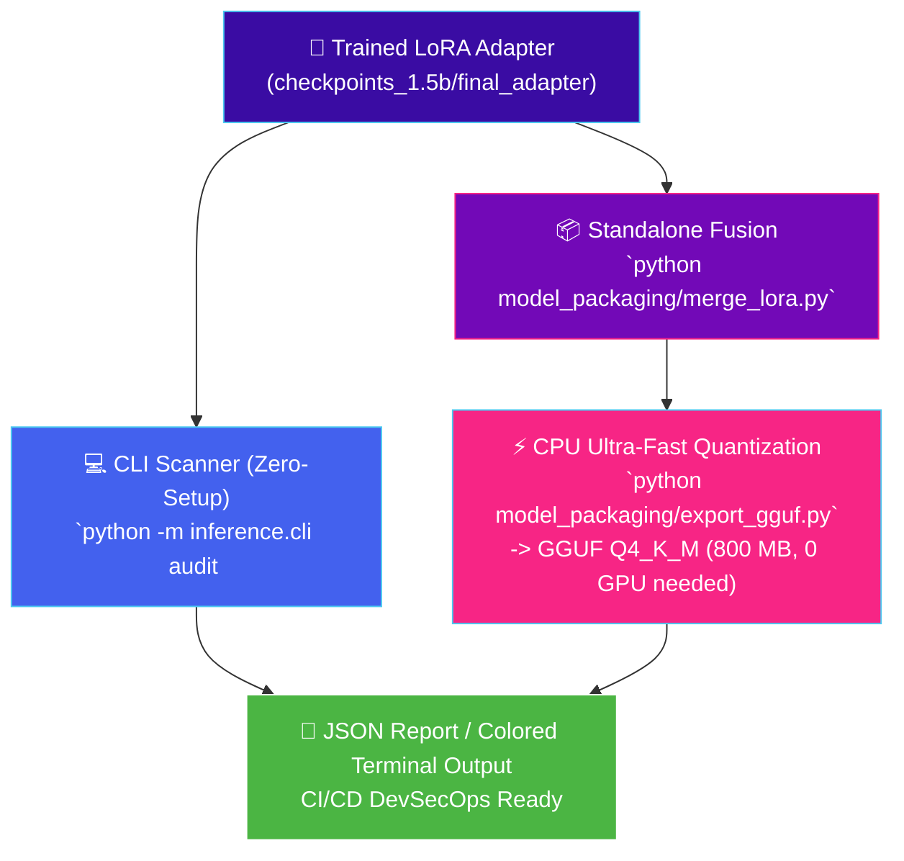

# 🛡️ Auth & Authorization Security AI Auditor — System Architecture

An overview of the **Auth Security Model** architecture, neural network design, reinforcement learning mechanisms, and inference pipeline.

---

## 1. 🌟 High-Level System Overview



---

## 2. 🔬 Deep Neural Network Architecture

The auditor combines a high-capacity code foundation model with a low-rank adapter trained on auth/authz vulnerability patterns:



### Key Specifications:
- **Base Parameters:** 1.54 Billion (Frozen in 4-bit NF4 / Float16).
- **Trainable Parameters:** ~18.4 Million (0.012% of total model weights).
- **LoRA Hyperparameters:** Rank $r = 16$, Scaling Alpha $\alpha = 32$, Dropout = $0.05$.
- **Target Projection Layers:** `q_proj`, `k_proj`, `v_proj`, `o_proj`, `gate_proj`, `up_proj`, `down_proj`.
- **Memory Footprint:** Only **~1.2 GB VRAM** in 4-bit mode (Runs seamlessly on any consumer GPU or Google Colab/Kaggle free tier).

---

## 3. 🔁 Error-Driven Punishment & Self-Correction Loop

The model was hardened using an active error-mining punishment pipeline:



---

## 4. 🛡️ Vulnerability Detection Taxonomy

The model detects 4 critical authorization & authentication CWE categories across 6 programming languages:

| Vulnerability Class | CWE Identifier | Real-World Scenario Detected |
|---|:---:|---|
| **IDOR** | `CWE-639` | Unscoped direct database lookups (e.g., `db.query(Doc).filter(Doc.id == doc_id)` without tenant/user verification). |
| **Auth Bypass** | `CWE-287` | JWT algorithm `'none'` attacks, trusted `X-Forwarded-User` headers, and string equality timing attacks in HMAC/signatures. |
| **Missing Authz Check** | `CWE-862` | Administrative endpoints/controllers lacking `@PreAuthorize`, `[Authorize]`, or role check guards. |
| **Incorrect Authz** | `CWE-863` | Inverted enum role comparisons (`role <= Role.ADMIN`), bitmask zero default bypasses, and SpEL parameter mismatches. |
| **Sound / Clean Baseline** | `None` | Constant-time `crypto.timingSafeEqual`, scoped ORM queries, and single-use atomic tokens (*0 False Alarms target*). |

---

## 5. 🌐 Multi-Language & Framework Support



---

## 6. 🚀 Inference & Deployment Options



---

## 7. 📈 Benchmark Progression

```
Raw Base Qwen2.5-Coder (No LoRA)  : [███████░░░░░░░░░░░░░] 73.33% Acc (57.1% False Positives)
Initial Fine-Tuning Pass          : [██████████████████░░] 96.67% Acc ( 7.1% False Positives)
After 4x Penalty Reinforcement    : [███████████████████▉] 98.33% Acc ( 3.5% FP, 100% Recall, 0.9846 F1)
```

---

## 8. 🛠️ Quick Start

```bash
# 1. Audit a single source code file
python -m inference.cli audit ./path/to/api.py

# 2. Scan an entire directory recursively
python -m inference.cli audit ./backend_project

# 3. Generate machine-readable JSON for CI/CD pipelines
python -m inference.cli audit ./backend_project --json
```
