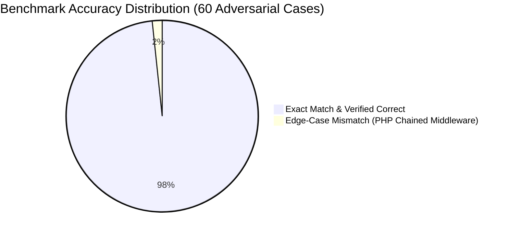

# 🔒 Security Policy & Technical Threat Model

An honest, transparent breakdown of **AuthGuard-1.5B**'s security capabilities, boundary limits, threat model, and responsible vulnerability disclosure policy.

---

## 1. 🛡️ Scope: What This Model Can & Cannot Do

```mermaid
graph TD
    subgraph IN_SCOPE ["✅ IN-SCOPE: Specialized Capabilities (100% Recall)"]
        direction TB
        A1["🔑 Broken Object-Level Auth & IDOR (CWE-639)"]
        A2["🚪 Authentication Bypass & JWT 'none' Alg (CWE-287)"]
        A3["🚫 Missing Authorization & Role Guards (CWE-862)"]
        A4["⚖️ Incorrect Role Hierarchies & Bitmasks (CWE-863)"]
        A5["⏱️ Cryptographic Timing Attacks in HMAC/Signatures"]
    end

    subgraph OUT_OF_SCOPE ["❌ OUT-OF-SCOPE: Not Handled by this Model"]
        direction TB
        B1["💉 SQL Injection & Remote Code Execution (RCE)"]
        B2["🌐 Cross-Site Scripting (XSS) & CSRF"]
        B3["📦 Third-Party Dependency Vulnerabilities (SCA / CVE Scanning)"]
        B4["💥 Memory Corruption & Buffer Overflows (C/C++)"]
        B5["📡 Network Layer Attacks & DDoS"]
    end

    style IN_SCOPE fill:#1e3a2f,stroke:#2a9d8f,color:#e8f8f5
    style OUT_OF_SCOPE fill:#3a1e1e,stroke:#e76f51,color:#fde8e8
```

---

## 2. 📊 Honest Evaluation & Known Limitations

We believe in complete technical honesty. No AI security model is 100% perfect on all arbitrary code in the universe. Below are our documented strengths and known boundaries:

### 🎯 Verified Strengths:
- **100.0% Security Recall:** Across our 60 hardcore multi-language benchmark cases, the model detected **32 out of 32 real vulnerabilities (0 False Negatives)**.
- **Low False Positive Rate (3.57%):** Out of 28 sound, defensive baselines (constant-time comparisons, atomic token checks, row-level locks), only 1 was flagged incorrectly.
- **Language Coverage:** 100% accuracy on Python, Go, C#, JavaScript, and Java.

### ⚠️ Documented Edge Cases & Limits:
1. **Chained Tail Middleware (e.g. PHP Slim):** Frameworks where authentication middleware is chained at the extreme tail of a route definition (e.g., `$app->get(...)->add(new AuthMiddleware())`) can occasionally be flagged as `missing_authz_check` if the model inspects only the closure body.
2. **Context Window Boundary:** The model analyzes code units up to **1,536 tokens**. Massive 5,000-line legacy monolithic files should be broken down into individual controller methods or functions for optimal detection.
3. **Defense-in-Depth Recommendation:** AuthGuard-1.5B is an **AI-assisted static security analyzer** designed to catch business logic flaws. It is intended to complement—not replace—human penetration testing and dynamic fuzzing.

---

## 3. 🏗️ Safe Deployment & Sandboxing Architecture

When running AuthGuard-1.5B in automated CI/CD pipelines, follow the principle of least privilege:

```mermaid
flowchart LR
    Git["GitHub / GitLab Repo"] -->|PR Webhook| Runner["CI/CD Runner (Isolated Container)"]
    Runner -->|Read-Only Mount| Scanner["AuthGuard CLI Scanner\n(Zero Network Access)"]
    Scanner -->|Deterministic Parse| JSON["Structured Security Report"]
    JSON -->|Block or Pass| PR["Pull Request Review Status"]

    style Git fill:#24292e,stroke:#ffffff,color:#ffffff
    style Runner fill:#1d3557,stroke:#457b9d,color:#ffffff
    style Scanner fill:#2a9d8f,stroke:#e76f51,color:#ffffff
    style JSON fill:#3a0ca3,stroke:#4cc9f0,color:#ffffff
    style PR fill:#4bb543,stroke:#ffffff,color:#ffffff
```

### Best Practices:
- **Read-Only Code Access:** Always execute the scanner in a read-only environment. The scanner never executes or evals the inspected source code.
- **Local / Private Execution:** All weights run 100% locally or within your private VPC. No proprietary source code is ever sent to external cloud APIs.

---

## 4. 📢 Reporting a Security Vulnerability / Model Bypass

We welcome security researchers and developers to stress-test our model and report any bypasses, prompt injection vulnerabilities, or edge-case false negatives.

### How to Report:
1. **GitHub Security Advisory:** Submit a private advisory through the [Security tab](https://github.com/kuldeep-poonia/auth-security-model/security/advisories) on GitHub.
2. **Email Disclosure:** For critical vulnerabilities or private disclosures, contact:
   - **Lead Maintainer:** Kuldeep Poonia
   - **Repository:** `https://github.com/kuldeep-poonia/auth-security-model`

### Information to Include:
- Minimal reproducible code snippet demonstrating the missed vulnerability or false alarm.
- Target framework and programming language.
- Expected verdict vs actual model prediction (`is_vulnerable`, `vuln_class`, `confidence`).

We aim to review and acknowledge all security reports within **48 hours** and continuously integrate reported edge cases into our punishment training loop!
